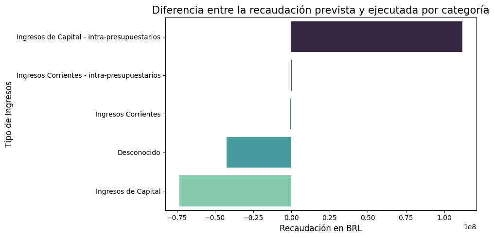

# Proyecto 2: EDA de los Ingresos Públicos de Brasil en el período comprendido entre 2013 y 2021.

En Data Science, EDA significa Exploratory Data Analysis (Análisis Exploratorio de Datos). Es una técnica utilizada para analizar y comprender conjuntos de datos, que permitan sacar conclusiones ellos o, aplicar modelos más complejos a posteriori.

Sus objetivos principales son:
- Revelar estructuras subyacentes en los datos.
- Identificar patrones o anomalías.
- Entender las relaciones entre variables.

A menudo, se emplean métodos de visualización de datos para resumir las características principales y obtener una mejor comprensión de los datos.

Lo anterior, es lo que aplicaremos para este proyecto.

## Planteamiento: **Análisis de la Ejecución de Ingresos Públicos en Brasil**

El gobierno de Brasil, a través de sus distintos órganos, gestiona la recaudación de ingresos públicos para financiar los servicios y proyectos que benefician a la sociedad. Cada año, se realiza una planificación detallada para prever cuánto se espera recaudar, pero a menudo la recaudación real difiere de lo previsto debido a diversos factores como la evasión fiscal, fluctuaciones económicas, ineficiencias administrativas, entre otros.

Has sido contratado por la Secretaría de Hacienda para analizar los datos históricos de la ejecución de ingresos entre 2013 y 2021. La misión es identificar patrones, detectar áreas problemáticas donde la recaudación ha sido consistentemente menor a lo previsto, y proponer recomendaciones basadas en los datos que ayuden a mejorar la precisión de las previsiones y la eficiencia de la recaudación.

Los problemas concretos que nos han pedido resolver son:

1.	**Desviaciones entre lo previsto y lo recaudado**: Determinar en qué categorías económicas o tipos de ingresos las diferencias son más pronunciadas.

2.	**Evolución temporal de la recaudación**: Identificar cómo han cambiado las previsiones y recaudaciones año a año, y si existen patrones temporales, como meses específicos donde hay mayores discrepancias.

3.	**Rendimiento por órgano y unidad gestora**: Evaluar qué órganos o unidades gestoras son más eficientes en términos de alcanzar las metas de recaudación y cuáles presentan consistentemente una baja ejecución.

## Objetivos del Proyecto

- **Limpieza de datos:** Resolver problemas comunes como valores nulos, formatos inconsistentes y duplicados.

- **Unión de conjuntos de datos:** Combinar todos los archivos en un solo dataframe para análisis global. Si es necesario, deberéis crear una columna extra para no perder información. 

- **Análisis Exploratorio de Datos (EDA):** Examinar la relación entre diferentes variables clave y explorar categorías relevantes para identificar patrones o discrepancias significativas.

- **Visualización:** Generar gráficos que permitan identificar tendencias y patrones relevantes en los datos analizados.

## Estructura del repositorio

### Notebooks
Las distintas fases del proyecto se han dividido en tres cuadernos de Jupyter (.ipynb), con uno adicional de soporte.

1.	**Exploración:**: entender la estructura y relaciones de los datos para unificarlos en un sólo dataframe.

2.	**Limpieza:** ejecutar tareas de normalización de los datos, incluyendo nombres de columnas, nulos, duplicados y tipos de datos.

3.	**Análisis y Visualización:** identificar relaciones, tendencias y usar herramientas de visualización para explicarlas.

4.	**Soporte Diccionarios:**: creación de diccionarios ubicados en "soporte_variables.py"

### Src
Archivos de soporte, manteniendo los notebooks más ordenados:

- soporte_limpieza: archivo .py con funciones utilizadas en el tratamiento de los datos.
- soporte_variables: archivo .py que almacena diccionarios usados para el tratamiento de los datos.

### Datos
Aquí pueden consultarse los datos sin tratar del proyecto. Los CSVs resultantes de la unión y limpieza no pueden ser consultados por la limitación de 100MB en el tamaño de archivo de GitHub.

### Imágenes
Archivos de imagen de soporte para el proyecto.

## Lenguaje y requisitos
El proyecto fué elaborado con Python 3.9 y la instalación de 5 librerías:

- pandas
- numpy
- matplotlib.pyplot
- seaborn
- sys

Debes clonar el repositorio completo e ir ejecutando los notebooks en el orden establecido, de modo que se vayan generando los archivos CSV necesarios.

## Conclusiones
Las principales conclusiones del EDA pueden consultarse en cada cuaderno. Mencionamos en líneas generales algunas de ellas:

1. El contenido de los dataframes corresponde a la recaudación del gobierno brasileño. En total, se han tratado 9 dataframes que contenían la misma información para 9 años. 

2. Se ha normalizado el contenido de filas y columnas, consiguiendo que los datos se correspondan con el tipo de la columna.

3. Para aportar legibilidad y manejabilidad, el número de columnas se ha reducido de 16 a 11, eliminando información duplicada, difícil de entender, innecesaria o en su mayoría faltante.

4. Los valores nulos se han reducido a cero, sacrificando únicamente un 9% del total de filas, aportando información más relevante para el análisis.

5. Salta a la vista que el gobierno no registra ni un 1% de los montos que ingresa. De la misma forma, hay una desviación entre lo que prevé ingresar y lo que realmente ingresa.

6. La tendencia de los ingresos es en general alcista, y se corresponde con un período de tiempo en que la economía brasileña creció constantemente.

7. En general, se plantean interrogantes sobre la gestión de los recursos, tanto las previsiones como los registros, que, al no contabilizarse de manera adecuada, llevarían a una gestión inadecuada.

## Propuestas

1. Puesta en marcha de una auditoría comprensiva de los Ministerios de Planificación y Hacienda, responsables por la preparación de las cuentas en Brasil, que permita identificar y corregir los métodos por los que se estén preparando los presupuestos y se estén registrando los ingresos. La falta de precisión en los datos lleva indiscutiblemente a una mala gestión de los recursos, y por ende de, la que es la novena economía del mundo.

2. Sería preciso investigar también los métodos y procedimientos del "Tribunal de Contas da União", que es el Tribunal de Cuentas de Brasil, y según se lee en su página web, conduce auditorías y su principal cometido es la "lucha incesante contra la corrupción, el desperdicio y el uso inadecuado de los recursos federales", por cuanto, no se entiene que desviaciones como las identificadas en este EDA hayan podido pasar desapercibidas para este Tribunal.

3. Poner en marcha métodos y procedimientos revisados para la previsión, registro y recaudación de los ingresos del Estado, que sean fiscalizados por un período extendido de tiempo, de manera que puedan corregirse las desviaciones y malas prácticas que han llevado a las inconsistencias evidenciadas en este EDA.

4. Determinar el uso que han tenido los ingresos recaudados pero no registrados durante el período de análisis, con el fin de identificar posibles gestiones inadecuadas.

